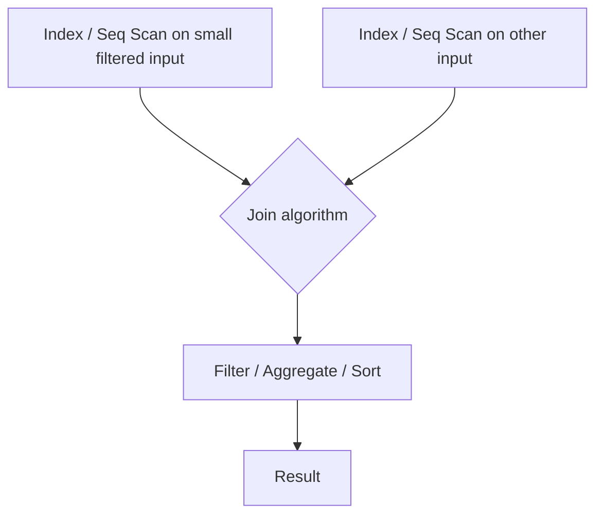
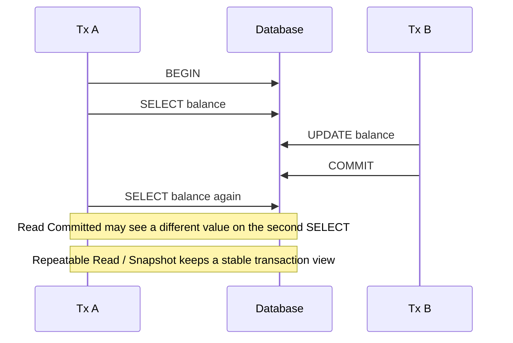
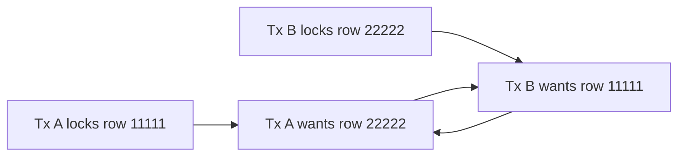
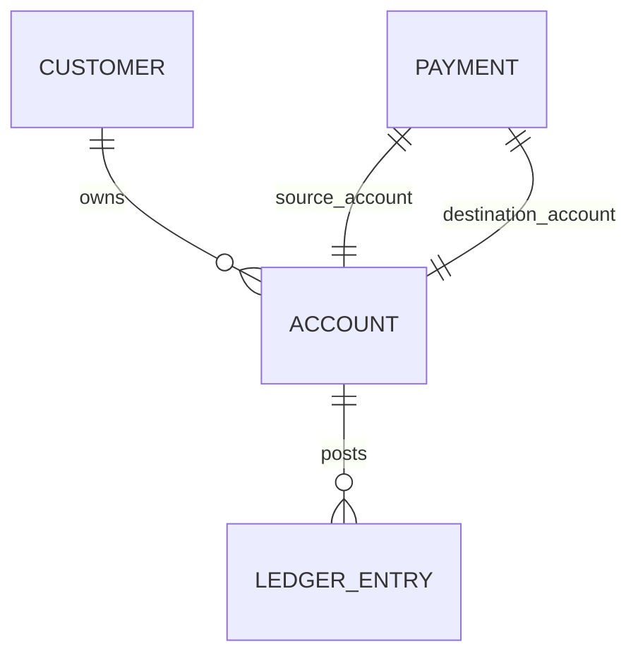
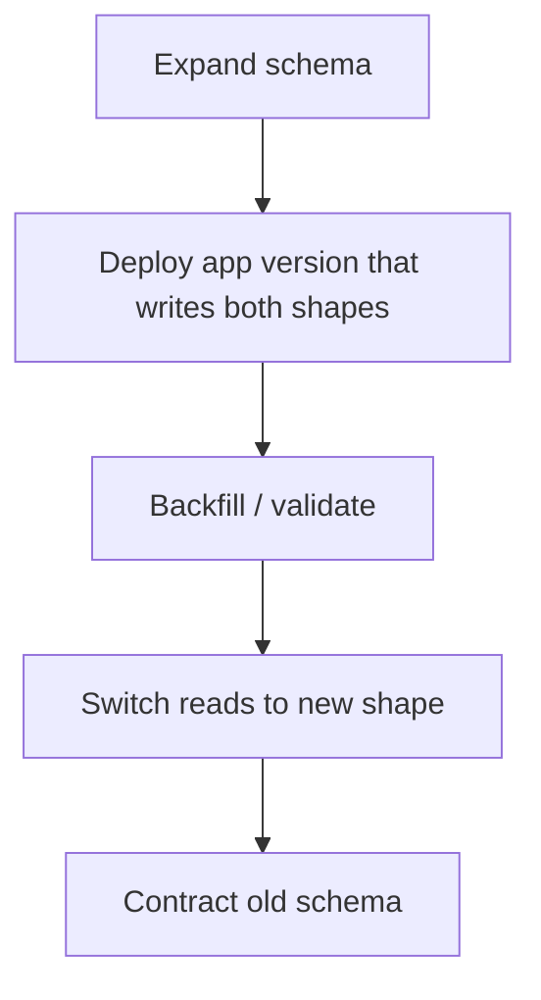

# SQL Field Guide

##  Summary
The guide is PostgreSQL-first as the primary teaching database but intentionally bilingual in database thinking and SQL Server deltas called out where they matter. 

General approach to writing SQL: 
- pick the weakest isolation level that still preserves the business invariant; 
- keep transactions short and deterministic; 
- index for your workload, not for wishful thinking; 
- compare estimated versus actual rows in execution plans;
- normalize the source of truth, denormalize only with explicit ownership;
- and treat schema migration as a production change-management problem, not just a [[DDL]] problem. 

---
## Joins, indexes, and execution-plan thinking

**Concise definitions** 
- A join combines rows from multiple relations according to a match condition. 
- An index is a secondary structure that can reduce the cost of finding rows, joining rows, or satisfying ordering. 
- An execution plan is the optimizer’s chosen sequence of scans, joins, filters, sorts, and aggregations used to answer the query. 

PostgreSQL’s docs describe join queries as combining rows from one table with rows from another, and both PostgreSQL and SQL Server emphasize that the optimizer selects access methods and join order based on schema and statistics. 

**Why it matters in production** 
Many critical queries are join-heavy: account + customer + ledger + authorization + settlement + status tables. The difference between an index seek plus selective join and a broad scan plus hash-and-sort can be the difference between predictable millisecond latency and a noisy, blocking workload. Statistics quality is central because both PostgreSQL and SQL Server planners depend on row-count estimates to choose good plans. 

**Execution-plan thinking means** reading the plan as a tree and asking: what is the driving relation, how are rows accessed, where are row counts reduced, which join algorithm was chosen, and where do estimates differ from reality. 
 Actual plans add runtime information such as row counts, resource usage, and warnings. 
[[How to read an execution plan]]



A practical rule: the same logical SQL can compile to very different physical plans. PostgreSQL’s EXPLAIN examples show nested loop, hash join, and merge join as alternative physical strategies for joins, and SQL Server likewise models execution as a tree of physical operators. 

### What to know cold

| Concern                              | PostgreSQL                                                                                   | SQL Server                                                            |
| ------------------------------------ | -------------------------------------------------------------------------------------------- | --------------------------------------------------------------------- |
| Base optimizer inputs                | Query, schema, statistics, planner heuristics                                                | Query, schema, statistics, optimizer heuristics                       |
| Join algorithms you should recognize | Nested Loop, Hash Join, Merge Join                                                           | Nested Loop, Hash Match, Merge Join operators in showplan             |
| Covering behavior                    | Index-only scans require index support and all needed columns to be available from the index | Nonkey included columns can cover a query and avoid base-table access |
| Subset indexing                      | Partial indexes                                                                              | Filtered indexes                                                      |
| Multicolumn caution                  | Use sparingly; more than three columns is often not useful unless workload is stylized       | Keep index keys narrow; don’t over-index heavily updated tables       |

### Common pitfalls
Many candidates know join syntax but cannot explain *plan shape*. A classic failure mode is saying “add an index” without naming the predicate, selectivity, or whether the optimizer will actually prefer the index. PostgreSQL warns that without `ANALYZE`, plan costing is almost certainly inaccurate, and SQL Server emphasizes dependence on distribution statistics for selectivity estimation. 

Another pitfall is misunderstanding composite indexes. Index column order matters because the index is ordered by key position, not by some abstract “most selective first” rule. PostgreSQL supports multicolumn indexes, but its docs tell you to use them sparingly; Use The Index, Luke gives the intuition that the first column is the primary sort criterion for a concatenated [[B-tree index]]. 

A third pitfall is assuming that “index seek good, scan bad.” That is too simple. Both PostgreSQL and SQL Server note that scans can be cheaper when a large fraction of a table is needed, or when a sequential access pattern beats many random lookups. 


[[How to read an execution plan]]
“I think in terms of access path and [[cardinality]]. I want the optimizer to start from the most selective predicate it can estimate correctly, join in an order that keeps intermediate row counts small, and avoid unnecessary sorts or heap lookups. So I look at estimated versus actual rows, whether I got seek/index-only behavior or scan/lookup behavior, and whether the chosen join method matches the data shape.” 

### Short PostgreSQL examples

```sql
-- Example: partial index for a hot operational subset
CREATE INDEX CONCURRENTLY payments_pending_idx
ON payments (created_at)
WHERE status = 'PENDING';

EXPLAIN ANALYZE
SELECT id, created_at
FROM payments
WHERE status = 'PENDING'
ORDER BY created_at
LIMIT 50;
```

This is a PostgreSQL partial-index pattern: index the operational subset you actually query. SQL Server’s nearest equivalent is a filtered nonclustered index. In both engines, this can improve plan quality while reducing maintenance cost compared with a full-table index. 

```sql
-- Example: cover a query to reduce heap access
CREATE INDEX accounts_customer_status_inc
ON accounts (customer_id, status)
INCLUDE (balance, updated_at);

EXPLAIN ANALYZE
SELECT balance, updated_at
FROM accounts
WHERE customer_id = 42
  AND status = 'ACTIVE';
```

In PostgreSQL, `INCLUDE` adds non-key columns so an index-only scan can answer more queries without visiting the heap, subject to index-only scan rules. In SQL Server, included columns serve the same broad purpose for nonclustered covering indexes. 

A concise way to explain the three major join algorithms:
- **Nested loop**: good when the outer side is small and the inner side can be probed efficiently, often by index. 
- **Hash join**: good for larger, unsorted inputs; build a hash table on the smaller side, probe with the other side. 
- **Merge join**: good when both inputs are already sorted or can be sorted cheaply on the join keys. 

### Recommended further reading 
- PostgreSQL “Joins Between Tables” ;
- [PostgreSQL “Using EXPLAIN”](https://www.postgresql.org/docs/current/using-explain.html)
- PostgreSQL “Statistics Used by the Planner” ;
- PostgreSQL “Indexes” chapter ; 
- SQL Server “Query Processing Architecture Guide”;
- SQL Server “Logical and Physical Showplan Operator Reference” ; 
- Use The Index, Luke on PostgreSQL plan operations and multi-column indexes ; 
- explain.depesz project page 

### Interview questions to be ready for
- Why would the optimizer choose a hash join instead of a nested loop?
- When is a scan cheaper than an index seek or index scan?
- What is the difference between a composite index and two separate single-column indexes?
- What do you do when estimated rows and actual rows are far apart?
- What is the practical difference between a covering index and a non-covering index?

---
## Transactions and isolation basics
**Concise definition.** A transaction groups multiple operations into one atomic unit. Isolation level defines what one transaction is allowed to observe about concurrent transactions.
PostgreSQL’s tutorial frames a transaction as bundling multiple steps into one all-or-nothing operation, while the PostgreSQL and SQL Server isolation docs describe the anomalies each isolation level permits or forbids. 

**Why it matters in production?** 
Correctness often depends on preserving invariants under concurrency: no double-spend, no negative balance past policy, no duplicate posting, no inconsistent read across related state. 
Isolation is never “free”: stronger guarantees can reduce concurrency, increase retries, or increase version-store / monitoring overhead depending on engine. 

### Practical comparison

| Isolation topic  | PostgreSQL                                                                                            | SQL Server                                                                                             |
| ---------------- | ----------------------------------------------------------------------------------------------------- | ------------------------------------------------------------------------------------------------------ |
| Read Uncommitted | Behaves like Read Committed; dirty reads are not exposed                                              | Dirty reads allowed                                                                                    |
| Read Committed   | Statement-level snapshot of committed data at statement start; default                                | Default on SQL Server; with RCSI OFF uses shared locks, with RCSI ON uses row versioning per statement |
| Repeatable Read  | Stronger than standard RR: no phantom reads in PostgreSQL, but serialization anomalies still possible | Holds shared locks to transaction end; phantom reads still possible                                    |
| Serializable     | Strictest level; retry on serialization failures; PostgreSQL uses predicate-lock-based monitoring     | Strictest locking level; range locks protect key ranges until transaction end                          |
| Snapshot flavor  | PostgreSQL MVCC is always on; Serializable adds additional anomaly detection                          | Snapshot and RCSI are optional row-versioning modes                                                    |



 “Statement snapshot” and “Transaction snapshot” are different. In PostgreSQL Read Committed, each statement sees committed data as of statement start. In PostgreSQL Repeatable Read, the transaction sees a stable snapshot as of its first non-transaction-control statement. In SQL Server, default Read Committed usually means locking unless RCSI is enabled, while Snapshot gives a transaction-level versioned view. 

### Common pitfalls
The first pitfall is assuming “Serializable means no retries.” In PostgreSQL, Serializable explicitly requires applications to be ready to retry when serialization failures occur. That is a feature, not a bug: the engine is refusing an execution that cannot be serialized safely. 

The second pitfall is treating SQL Server Read Committed as one fixed behavior. It is not. With `READ_COMMITTED_SNAPSHOT = OFF`, reads use shared locks; with it `ON`, reads are versioned at statement scope. That difference is operationally huge for blocking behavior. 

The third pitfall is using a stronger isolation level than the business invariant demands. Sometimes explicit row locking on a small set of rows is cheaper than global Serializable. Other times, Serializable with retries is simpler and safer than hand-rolled lock choreography. PostgreSQL explicitly notes that Serializable can be a better performance choice than broad explicit locking in some environments. 

### Interview-ready phrasing
“I choose isolation based on the invariant, not on habit. For ordinary read/write CRUD, Read Committed is often enough. For stable multi-statement reads, Repeatable Read or Snapshot may be better. For correctness-critical invariants across predicates, Serializable is the cleanest option, but I design the application to retry serialization failures.” 

### Short PostgreSQL examples
```sql
-- Example: stable business operation with explicit isolation
BEGIN;
SET TRANSACTION ISOLATION LEVEL SERIALIZABLE;

SELECT balance
FROM accounts
WHERE id = 42;

UPDATE accounts
SET balance = balance - 100
WHERE id = 42;

COMMIT;
```

In PostgreSQL, Serializable may abort with SQLSTATE `40001`, so the app must retry the full transaction. In SQL Server, the closest conceptual equivalents are `SERIALIZABLE` or sometimes `SNAPSHOT`, but they behave differently: SQL Server Serializable uses range locks, while Snapshot uses row versioning. 

```sql
-- Example: default Read Committed behavior in PostgreSQL
BEGIN;
SET TRANSACTION ISOLATION LEVEL READ COMMITTED;

SELECT *
FROM payments
WHERE account_id = 42;

COMMIT;
```

In PostgreSQL Read Committed, each statement sees a fresh committed snapshot. 
In SQL Server Read Committed, whether reads block depends heavily on whether RCSI is enabled. 

### Recommended further reading
- PostgreSQL “Transactions” tutorial ;
- PostgreSQL “Transaction Isolation” ;
- SQL Server “SET TRANSACTION ISOLATION LEVEL” ;
- SQL Server “Transaction Locking and Row Versioning Guide” ; 
- MySQL InnoDB “Transaction Isolation Levels” for cross-vendor contrast 

### Interview questions to be ready for
- Why does PostgreSQL Read Uncommitted behave like Read Committed?
- What is the difference between statement-level and transaction-level consistency?
- When would you prefer Serializable over explicit row locks?
- Why do serialization failures require retry logic?
- How does SQL Server Read Committed change when RCSI is enabled?

--- 
## Locking and deadlocks
**Concise definition.** 
- Locking is the engine’s way of coordinating conflicting access to shared resources. 
- A deadlock is a cyclic wait: transaction A waits on a resource held by B, while B waits on a resource held by A. 

PostgreSQL and SQL Server both define deadlocks this way and both engines resolve them by aborting one participant. 

**Why it matters in production.** Locks are normal; long blocking chains and deadlocks are the problem. Deadlocks often appear under peak load when multiple sessions update the same logical entities in inconsistent order. Short, deterministic transactions are a reliability feature, not just a performance best practice. 



PostgreSQL’s docs show exactly this kind of two-row deadlock and say the best defense is consistent lock acquisition order. SQL Server’s deadlock guidance says essentially the same thing: access objects in the same order, keep transactions short, avoid unnecessary higher isolation, and handle deadlock-victim error 1205 with retry logic.

### Common pitfalls
The first pitfall is confusing blocking with deadlock. Blocking is one-way waiting and may resolve normally. Deadlock is cyclical and requires victim selection. SQL Server’s deadlock guide explicitly distinguishes them. 

The second pitfall is assuming row versioning removes all lock problems. It reduces many read/write blocks, but metadata locks, write/write conflicts, schema locks, and some deadlocks still happen. SQL Server’s row-versioning guide notes that queries still acquire schema stability locks, and PostgreSQL Serializable predicate locks are about conflict detection rather than ordinary blocking. 

The third pitfall is holding transactions open across network calls, user input, or long application work. PostgreSQL explicitly warns that waits continue indefinitely unless a deadlock is detected, so long-lived transactions are a bad idea. 

### Interview-ready phrasing
A strong answer sounds like this: “I expect blocking under concurrency; I try to make it brief and predictable. To prevent deadlocks, I standardize access order, keep transactions short, lock the smallest necessary set of rows, and implement safe retry on deadlock-victim errors or serialization failures.” 

### Short PostgreSQL examples
```sql
-- Session A
BEGIN;
UPDATE accounts SET balance = balance + 100 WHERE acctnum = 11111;
UPDATE accounts SET balance = balance - 100 WHERE acctnum = 22222;
COMMIT;
```

```sql
-- Session B, dangerous if executed in reverse row order
BEGIN;
UPDATE accounts SET balance = balance + 100 WHERE acctnum = 22222;
UPDATE accounts SET balance = balance - 100 WHERE acctnum = 11111;
COMMIT;
```

This is the classic deadlock shape from the PostgreSQL docs. The fix is often trivial: always update rows in the same order, for example ascending account number. In SQL Server, the same principle is official guidance, and deadlock victims should be retried. 

```sql
-- Safer pattern when you must reserve work explicitly
BEGIN;

SELECT id
FROM jobs
WHERE status = 'PENDING'
ORDER BY id
FOR UPDATE SKIP LOCKED
LIMIT 10;

COMMIT;
```

This PostgreSQL row-locking pattern is useful for worker queues because it reduces contention among consumers. In SQL Server, you often see analogous patterns with locking hints such as `UPDLOCK` depending on the workload, but the exact semantics differ. PostgreSQL’s row-locking docs define what `FOR UPDATE` blocks and when locks are released.

### Recommended further reading
- PostgreSQL “Explicit Locking”;
- PostgreSQL `pg_locks` discussion;
- SQL Server “Deadlocks Guide”; 
- SQL Server “Transaction Locking and Row Versioning Guide” 

### Interview questions to be ready for
- What is the difference between blocking and deadlock?
- Why does consistent access order prevent deadlocks?
- When would you use `SELECT ... FOR UPDATE`?
- What should the application do after a deadlock victim error?
- Why can deadlocks still happen even when row versioning is enabled?

---
## Normalization and practical tradeoffs

**Concise definition.** Normalization organizes data so each fact is stored in one place, reducing redundancy and insert/update/delete anomalies. Microsoft describes normalization as organizing data into tables and relationships to eliminate redundancy and inconsistent dependency; Oracle’s data warehousing guide frames the goal as keeping each fact in one place to avoid anomalies. 

**Why it matters in production** For systems of record, normalization is about correctness first: a ledger entry, account, customer, or FX rate should have one authoritative representation. That reduces drift and simplifies auditing. In financial systems, the default posture should usually be “normalize the write model, denormalize the read model intentionally.” 



The tradeoff is simple: stricter normalization reduces redundancy and anomalies, but heavily read-optimized or analytics-heavy paths may justify controlled denormalization, materialized projections, cached balances, or CQRS-style read models. The mistake is not denormalization itself; the mistake is denormalizing without explicit ownership, backfill, reconciliation, and re-derivation rules. Oracle’s guidance explicitly notes that normalization targets redundancy and anomalies; that frames the tradeoff cleanly.

### Common pitfalls
A common pitfall is over-normalizing hot read paths until the application needs five or seven joins for a basic view. Another is under-normalizing the source of truth, which leads to duplicated balances, duplicated customer attributes, and silent drift. A senior answer distinguishes “authoritative data model” from “derived read model.”

### Interview-ready phrasing
“I prefer normalized writes for correctness and auditing, especially in transactional systems. If I denormalize, I want a clear owner, deterministic rebuild path, and a reason tied to a real workload, usually read performance, simplified query paths, or isolation of reporting from OLTP.” 

### Short PostgreSQL examples

```sql
-- Normalized source-of-truth tables
CREATE TABLE customers (
    id bigint PRIMARY KEY,
    full_name text NOT NULL
);

CREATE TABLE accounts (
    id bigint PRIMARY KEY,
    customer_id bigint NOT NULL REFERENCES customers(id)
);

CREATE TABLE ledger_entries (
    id bigint PRIMARY KEY,
    account_id bigint NOT NULL REFERENCES accounts(id),
    amount numeric(18,2) NOT NULL,
    created_at timestamptz NOT NULL
);
```

This model keeps ownership clear: customer data lives in `customers`, account ownership in `accounts`, financial postings in `ledger_entries`. That is easy to reason about and audit.

```sql
-- Controlled denormalized read model
CREATE TABLE account_balance_projection (
    account_id bigint PRIMARY KEY,
    current_balance numeric(18,2) NOT NULL,
    last_rebuilt_at timestamptz NOT NULL
);
```

This second table is acceptable if you treat it as a derived projection rather than as the legal source of truth. In an interview, say explicitly that the balance is re-derivable from ledger entries and that reconciliation matters. That phrasing signals production maturity. 

### Recommended further reading
- Microsoft “Database normalization description”; 
- Oracle “Data Warehousing Logical Design” normalization section 

### Interview questions to be ready for
- What anomaly is normalization trying to prevent?
- When is denormalization justified in a transactional system?
- What should remain the source of truth in a financial application?
- How would you keep a denormalized balance projection correct?
- Why is auditability easier with a normalized write model?

---
## Writing efficient queries
**Concise definition.** Writing efficient queries means shaping predicates, joins, ordering, and projection so the optimizer can choose low-cost access paths and avoid unnecessary work. In practice, that means selective predicates, narrow reads, correct indexes, realistic statistics, and avoiding query forms that hide useful predicates from the optimizer. 

**Why it matters in production** 
Even when the database is “fast enough” in QA, production workloads expose poor query shape through lock duration, CPU, memory grants, sort spills, and plan regressions. Efficient SQL reduces not only latency but also collateral damage to unrelated transactions. 

### Common pitfalls
The biggest pitfall is writing non-sargable predicates and then blaming the optimizer. PostgreSQL’s expression-index docs show that if you filter on `lower(col1)` and want index support, you may need an expression index on `lower(col1)`. SQL Server has the same broad concern via computed-column indexing and seekable predicates. 

Another pitfall is `SELECT *` on hot paths. Projection matters because index-only / covering behavior depends on whether all referenced columns are available from the index. PostgreSQL’s index-only-scan docs and SQL Server’s included-columns docs both make this clear. 

A third pitfall is designing indexes from one query in isolation. PostgreSQL recommends experimentation on real data and emphasizes checking actual workload index usage, while SQL Server recommends monitoring and removing unused indexes over time. 

### Interview-ready phrasing
A concise senior answer is: “I try to make my predicates seekable, project only needed columns, and line up my indexes with the actual `WHERE`, `JOIN`, and `ORDER BY` patterns of the workload. Then I verify with actual plans, because good SQL text can still get a bad plan if statistics are stale or cardinality estimates are wrong.” 

### Short PostgreSQL examples

```sql
-- Less efficient unless you support it explicitly
SELECT *
FROM users
WHERE lower(email) = 'alice@example.com';
```

```sql
-- Better: support the predicate shape
CREATE INDEX users_lower_email_idx
ON users (lower(email));

EXPLAIN ANALYZE
SELECT id
FROM users
WHERE lower(email) = 'alice@example.com';
```

PostgreSQL explicitly documents this as an expression-index use case. SQL Server’s closest analogue is indexing a deterministic computed column. 

```sql
-- Query with ORDER BY + LIMIT that benefits from index order
CREATE INDEX ledger_entries_account_created_at_idx
ON ledger_entries (account_id, created_at DESC)
INCLUDE (amount);

EXPLAIN ANALYZE
SELECT amount, created_at
FROM ledger_entries
WHERE account_id = 42
ORDER BY created_at DESC
LIMIT 20;
```

This shape matters because PostgreSQL can sometimes satisfy `ORDER BY` directly from a B-tree index, avoiding a separate sort, and included columns can help index-only behavior. SQL Server’s nonclustered indexes with included columns are the parallel concept.

### Plan-shape heuristic
```text
Bad shape:
Seq Scan -> huge Hash -> Sort -> LIMIT

Better shape:
Index Scan/Only Scan on selective predicate -> already ordered -> LIMIT
```

That is not a law, but it is a useful interview heuristic. PostgreSQL explicitly notes that only [[B-tree index]]es can produce sorted output and that indexes are most useful when only a few rows are fetched. 

### Recommended further reading
- PostgreSQL “Indexes on Expressions” 
- PostgreSQL “Indexes and ORDER BY”; 
- PostgreSQL “Index-Only Scans and Covering Indexes”
- PostgreSQL “Examining Index Usage”
- SQL Server “Create Indexes with Included Columns” 
- Use The Index, Luke on avoiding “smart logic” and index design intuition 

### Interview questions to be ready for
- What makes a predicate non-sargable?
- Why can `ORDER BY ... LIMIT` be much faster with the right index?
- When would you add included columns instead of key columns?
- Why can stale statistics cause a bad plan even when the SQL is fine?
- Why is `SELECT *` often a performance smell on critical paths?

---
## Schema evolution and migrations

**Concise definition.** Schema evolution is the controlled change of database structure over time. Migrations are the operational mechanism by which those changes are applied safely across environments. In production, the hard part is rarely writing `ALTER TABLE`; it is minimizing lock impact, preserving compatibility, validating data, and having a rollback or retry strategy. 

**Why it matters in production.** 
A poorly timed [[DDL]] change can block writes, invalidate assumptions, or leave a database in a partially migrated state. In regulated or high-availability systems, you need forward-only discipline, reviewable scripts, backfill plans, validation steps, and observability during rollout. PostgreSQL and SQL Server both provide mechanisms for lower-disruption changes, but the details differ. 

### Practical comparison

| Migration concern                          | PostgreSQL                                                                     | SQL Server                                                                                    |
| ------------------------------------------ | ------------------------------------------------------------------------------ | --------------------------------------------------------------------------------------------- |
| Add constraint with lower write disruption | `NOT VALID` then `VALIDATE CONSTRAINT`                                         | Often script / publish incrementally; online support mostly via index operations, not all DDL |
| Build index without blocking writes        | `CREATE INDEX CONCURRENTLY`                                                    | `ONLINE = ON` for eligible index ops; resumable online operations supported in many cases     |
| Safety caveat                              | Concurrent index build can fail and leave an invalid index behind              | Online index ops still have restrictions and edition / feature constraints                    |
| Artifact-based deployment                  | `pg_dump` / `pg_restore`, `pg_upgrade`, logical replication for major upgrades | DACPAC / SqlPackage publish, deploy report, script generation                                 |
| App-level migration option                 | Usually SQL scripts or framework tooling                                       | EF Core supports SQL scripts, idempotent scripts, and migration bundles                       |



That expand–migrate–contract pattern is the safest default mental model for zero- or low-downtime changes. PostgreSQL’s `NOT VALID` and concurrent index features directly support this style, and SQL Server’s DACPAC scripting, online index operations, and EF Core idempotent scripts support structured rollout and review. 

### Common pitfalls
The first pitfall is adding a constraint or index on a large hot table with no lock analysis. PostgreSQL notes that many `ALTER TABLE` forms take strong locks, and standard index creation locks out writes until finished; `CONCURRENTLY` changes that tradeoff, but costs more work and time. 

The second pitfall is treating migration tooling as a substitute for review. SqlPackage can generate a deployment plan, script, and drift report, and EF Core can generate idempotent scripts; those are review aids, not permission to skip understanding the change. 

The third pitfall is ignoring upgrade path differences. PostgreSQL major-version upgrades can use `pg_upgrade` for fast in-place upgrades or logical replication for very low downtime; `pg_dump`/`pg_restore` is flexible but more disruptive than binary upgrade or replication-based cutover. 

### Interview-ready phrasing
“I separate schema design from change rollout. In production I prefer additive, backward-compatible migrations first, then backfill and validation, then code cutover, then cleanup. I choose mechanisms based on lock impact—like `NOT VALID` plus `VALIDATE CONSTRAINT` or concurrent / online index builds—and I prefer reviewable SQL scripts or deployment plans over blind push-button deployment.” 

### Short PostgreSQL examples
```sql
-- Add a foreign key with lower immediate impact
ALTER TABLE payments
ADD CONSTRAINT payments_account_id_fk
FOREIGN KEY (account_id)
REFERENCES accounts(id)
NOT VALID;

ALTER TABLE payments
VALIDATE CONSTRAINT payments_account_id_fk;
```

PostgreSQL documents this specifically as a way to reduce the impact of adding constraints on concurrent updates. The validation step uses a weaker lock than validating everything during `ADD CONSTRAINT`. 

```sql
-- Add uniqueness with less write interruption
CREATE UNIQUE INDEX CONCURRENTLY users_email_uq_idx
ON users (email);

ALTER TABLE users
ADD CONSTRAINT users_email_uq
UNIQUE USING INDEX users_email_uq_idx;
```

This is the PostgreSQL pattern for creating a uniqueness guarantee without blocking table updates for a long time. Important caveat: concurrent index builds take longer, require two scans, cannot run inside a transaction block, and can leave an invalid index behind on failure. SQL Server’s closest analogue is online index creation or rebuild where supported. 

### Recommended further reading
- PostgreSQL `ALTER TABLE`
- PostgreSQL `CREATE INDEX` and concurrent builds 
- PostgreSQL “Upgrading a PostgreSQL Cluster” 
- PostgreSQL `pg_upgrade`
- SQL Server “SqlPackage”
- SQL Server “Deploy a Data-Tier Application”
-  SQL Server “Perform index operations online” 
- EF Core “Applying Migrations” 

### Interview questions to be ready for
- How would you add a foreign key to a large hot table safely?
- Why is `CREATE INDEX CONCURRENTLY` useful, and what are its caveats?
- What is the expand–migrate–contract pattern?
- When would you prefer `pg_upgrade` over dump/restore?
- Why do you prefer reviewable migration scripts in production?

---
## One-page cheat sheet

**Joins and plans**
- Say “I optimize for row-count reduction early, correct join order, and avoiding unnecessary heap lookups and sorts.” 
- Know when nested loop, hash join, and merge join are normally preferred. 
- Compare estimated versus actual rows first; cardinality mistakes create plan mistakes. 
- Composite index order matters; more columns is not automatically better. 

**Isolation and concurrency**
- PostgreSQL Read Uncommitted behaves like Read Committed. 
- PostgreSQL Read Committed is statement-snapshot; Repeatable Read is transaction-snapshot; Serializable may abort and require retry. 
- SQL Server Read Committed is locking by default on SQL Server, but can be statement-versioned under RCSI. Snapshot is transaction-level row versioning. 
- Pick the weakest isolation level that still preserves the business invariant. 

**Locking and deadlocks**
- Blocking is normal; deadlock is cyclical waiting. 
- Main prevention rule: access shared objects in a consistent order. 
- Keep transactions short; never leave them open across user or network delays. 
- Retry deadlock victims and serialization failures at the application layer. 

**Normalization and query writing**
- Normalize the source of truth; denormalize derived read models deliberately. 
- Make predicates seekable and projections narrow. 
- If you search on an expression like `lower(email)`, index that expression or computed form. 
- Use partial / filtered indexes for hot subsets, not full tables by reflex. 

**Schema evolution**
- Prefer additive, backward-compatible migrations first. 
- In PostgreSQL, know `NOT VALID` + `VALIDATE CONSTRAINT`, and `CREATE INDEX CONCURRENTLY`. 
- In SQL Server, know DACPAC / SqlPackage publish + script / deploy report, and online index operations.
- In .NET shops, mention EF Core idempotent migration scripts or bundles as deployment-friendly options, not just `database update`. 

**High-value interview phrase**
- “I treat SQL performance as a combination of query shape, statistics quality, index design, and concurrency behavior; and I treat schema changes as production rollouts, not just DDL statements.” 